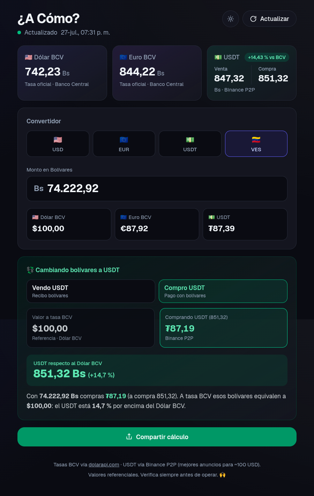
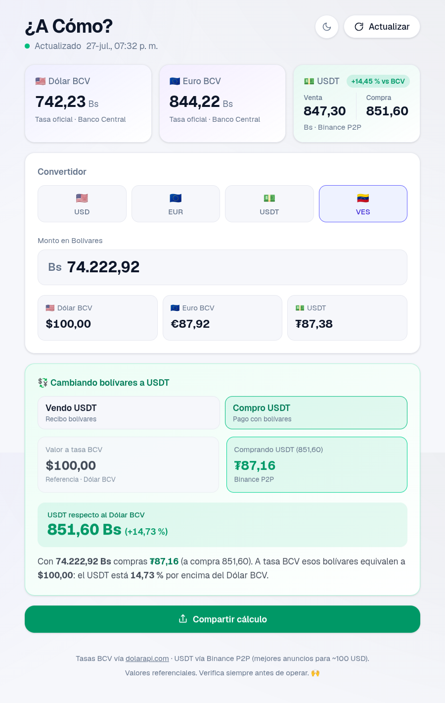
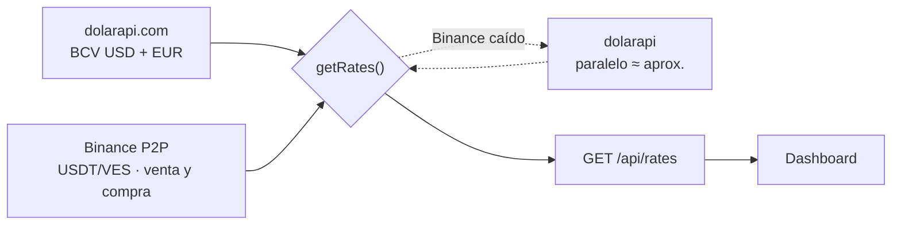

<div align="center">

# 👀 ¿A Cómo?

**¿A cómo está hoy?** Calcula tu cambio y compártelo en un toque.

Tasas del **BCV** y del **USDT en Binance P2P** en tiempo real, con lo que de verdad
importa: *cuánto te ahorras pagando en USDT en vez de a tasa oficial.*

[](https://nextjs.org)
[](https://react.dev)
[](https://www.typescriptlang.org)
[](https://tailwindcss.com)
[](#-pwa-instálala-como-app)
[](LICENSE)



<details>
<summary><b>☀️ Verla en tema claro</b></summary>
<br/>

</details>

</div>

---

## ✨ Qué hace

| | |
|---|---|
| 💱 **Convertidor de 4 monedas** | Bs, USD, EUR y USDT en cualquier dirección. Toca un resultado y se copia al portapapeles. |
| 💰 **Calculadora de ahorro** | El corazón de la app: compara cubrir un monto a tasa BCV vs. con USDT y te dice el ahorro en % y en plata. |
| 🔄 **Venta y compra por separado** | No usa un promedio: si vendes USDT aplica el precio de venta; si compras, el de compra. |
| 📡 **Tasas frescas** | Auto-refresco cada 90 s **solo con la pestaña visible**, más un botón de "Actualizar". |
| 🎯 **Tasa según tu monto** | La consulta a Binance se ancla al tamaño real de tu operación: la tasa de 100 $ no es la de 10.000 $. |
| 📲 **Comparte en un toque** | Arma el texto listo para WhatsApp con el menú nativo (o abre WhatsApp Web si no está disponible). |
| 🌙 **Oscuro por defecto + toggle** | Sin depender de `prefers-color-scheme`, que en varios WebViews de Android llega mal. |
| ⚡ **PWA offline** | Instalable, con splash screens de iOS y la última tasa conocida guardada para cuando no hay señal. |
| 🇻🇪 **Formato venezolano** | Punto para miles, coma para decimales, hora de Caracas y locale `es-VE` en todo. |

---

## 🧮 Cómo se calcula el ahorro

Todo pasa por bolívares. Dado un monto en Bs, la app compara las dos rutas para cubrirlo:

```
costo a tasa oficial  =  Bs ÷ tasa BCV
costo en USDT         =  Bs ÷ tasa USDT (venta o compra, según la operación)
ahorro %              =  (costo oficial − costo USDT) ÷ costo oficial × 100
```

**Ejemplo**: una cuenta de **1.160 Bs**, con BCV = 100 Bs/$ y USDT venta = 116 Bs.

| Ruta | Te cuesta |
|---|---|
| Pagando con Dólar BCV | **$ 11,60** |
| Vendiendo USDT | **₮ 10,00** |
| | 👉 **ahorras 13,79 %** ($ 1,60) |

Cada USDT rinde como **$ 1,16** del BCV. Si el monto está en euros, la comparación
se hace contra el **Euro BCV** en vez del dólar.

La lógica vive completa y sin dependencias en [`lib/exchange.ts`](lib/exchange.ts)
(`computeSavings`), así que es fácil de leer y de probar.

---

## 📡 De dónde salen las tasas



**BCV** → [`ve.dolarapi.com`](https://ve.dolarapi.com), revalidado cada 30 min (cambia una vez al día).

**USDT** → el libro de anuncios de Binance P2P, con varias decisiones deliberadas:

- Se promedian **solo los 5 mejores anuncios**, que es el rango al que uno cierra
  el cambio de verdad — no un promedio diluido por anuncios que nadie toma.
- Se filtra por **monto**: los anuncios de rangos millonarios sesgan la tasa, así que
  la búsqueda se ancla al equivalente de tu operación (por defecto ~100 $, calculado
  con el BCV del día para que escale con la devaluación).
- Los montos se agrupan en **tres rangos** (hasta 300 $, hasta 3.000 $, y de ahí para
  arriba) con caché en memoria de 60 s por rango: entre montos cercanos el precio casi
  no se mueve (~0,2 %), así que no hace falta golpear Binance en cada tecla.
- Binance responde **403 a clientes sin fingerprint de navegador**; los headers que lo
  resuelven (el que marca la diferencia es `clienttype: web`) están en
  [`lib/rates.ts`](lib/rates.ts). Aun así es intermitente, así que hay un reintento.
- Si Binance no responde, cae al **promedio del paralelo** de dolarapi, etiquetado
  claramente en la UI como aproximación.

`getRates()` **nunca lanza**: si una fuente falla, deja el valor en `0`, lo reporta en
`errors` y la UI avisa sin romperse ni perder la última tasa buena.

---

## 🚀 Arrancar

Necesitas **Node 20+**.

```bash
git clone git@github.com:rafaarraez/acomo.git
cd acomo
npm install
npm run dev
```

Abre <http://localhost:3000>. No hace falta ninguna API key: las dos fuentes son públicas.

| Script | Qué hace |
|---|---|
| `npm run dev` | Servidor de desarrollo (Turbopack). El service worker no se registra aquí, para no pelear con el hot-reload. |
| `npm run build` | Build de producción. |
| `npm start` | Sirve el build. |
| `npm run lint` | ESLint. |

### Variables de entorno

Dos, y las dos opcionales:

```bash
# .env.local
NEXT_PUBLIC_SITE_URL=https://tudominio.com
NEXT_PUBLIC_GA_ID=G-XXXXXXXXXX
```

- `NEXT_PUBLIC_SITE_URL` — sin ella la imagen de preview al compartir apunta a
  `localhost`. **Defínela al desplegar.**
- `NEXT_PUBLIC_GA_ID` — ID de medición de Google Analytics 4. Si no está definida no
  se carga ningún script de Analytics, así que en local no cuentas tus propias visitas.
  Defínela solo en el entorno de producción.

---

## 🗂 Estructura

```
app/
  page.tsx              Server Component: pide las tasas y renderiza el dashboard
  layout.tsx            Metadata, splash screens de iOS, script de tema pre-paint
  globals.css           Variables de color por tema + variante `dark:` a medida
  manifest.ts           Manifest de la PWA
  opengraph-image.tsx   Imagen que ven WhatsApp y redes al pegar el link
  api/rates/route.ts    GET /api/rates?ref=<Bs> → tasas frescas
components/
  dashboard.tsx         Toda la UI interactiva (convertidor, ahorro, header)
  theme-toggle.tsx      Botón claro/oscuro
  share-button.tsx      Web Share API con fallback a WhatsApp
  animated-number.tsx   Interpola las cifras al actualizarse
  service-worker.tsx    Registra el SW (solo en producción)
lib/
  exchange.ts           Tipos, conversión, ahorro y formateo — puro, sin servidor
  rates.ts              Fetch de dolarapi + Binance P2P, caché y fallbacks
  theme.ts              Clave de storage, colores y script de arranque del tema
public/
  sw.js                 Service worker (network-first para tasas, cache-first para estáticos)
  icon-192.png · icon-512.png
  splash/               Splash screens de iOS, una por resolución de iPhone
docs/                   Capturas del README (fuera de public/, no se despliegan)
```

### `GET /api/rates`

```bash
curl 'http://localhost:3000/api/rates?ref=80000'
```

`ref` es el monto de tu operación **en bolívares** (opcional). Devuelve el objeto
[`Rates`](lib/exchange.ts) con BCV USD/EUR, USDT venta/compra/promedio, la fuente usada,
el tamaño de la muestra y los errores. Sin caché, para que siempre sea el valor del momento.

---

## 🎨 Temas

El tema lo manda el atributo **`data-theme`** en `<html>`, no el sistema: en varios
WebViews de Android `prefers-color-scheme` llega mal y la app abría en claro.

- **Oscuro por defecto**, y la preferencia se guarda en `localStorage` (`dac:theme`).
- Un script inline en `<head>` la aplica **antes del primer paint** — cero parpadeo — y
  ajusta el `<meta name="theme-color">` de la barra del navegador.
- La variante `dark:` de Tailwind está redefinida en `globals.css` para responder al
  atributo, así que todas las clases `dark:*` del proyecto siguen funcionando igual.
- Los colores viven en cinco variables CSS (`--background`, `--surface`, `--foreground`,
  `--muted`, `--border`): para retocar la paleta, ese es el único lugar.

> [!NOTE]
> En una PWA **ya instalada** en Android, la barra de estado usa el `theme_color` del
> manifest (oscuro fijo), así que en modo claro puede quedarse oscura hasta reinstalar.

---

## 📲 PWA: instálala como app

Desde el navegador móvil, *Añadir a la pantalla de inicio*. Queda a pantalla completa,
con ícono, splash screen y funcionando sin conexión:

- La **página** y `/api/rates` van *network-first*: si no hay señal, se sirve la última
  copia guardada (ves la tasa de tu última visita, no una pantalla en blanco).
- Los **estáticos** van *cache-first*.
- El último cálculo (monto, moneda y dirección) se recuerda en `localStorage` (`dac:input`).

---

## ☁️ Desplegar

Pensada para [Vercel](https://vercel.com/new): importa el repo, define
`NEXT_PUBLIC_SITE_URL` (y `NEXT_PUBLIC_GA_ID` si quieres métricas) y listo.
La página es `force-dynamic` porque las tasas cambian
durante el día, así que necesita un runtime de Node — no funciona como export estático.

> [!IMPORTANT]
> La caché del P2P es **por proceso**. Con varias instancias cada una tiene la suya:
> igual acota bien las llamadas a Binance, pero no esperes un único caché compartido.

---

## ⚠️ Aviso

Los valores son **referenciales**, salen de fuentes públicas y pueden estar
desactualizados o caídos. Verifica siempre antes de operar. 🙌

---

## 📄 Licencia

[MIT](LICENSE) — úsalo, cámbialo y compártelo. Solo mantén el aviso de copyright.

<div align="center">

Hecho con 🤍 para Venezuela.

</div>
